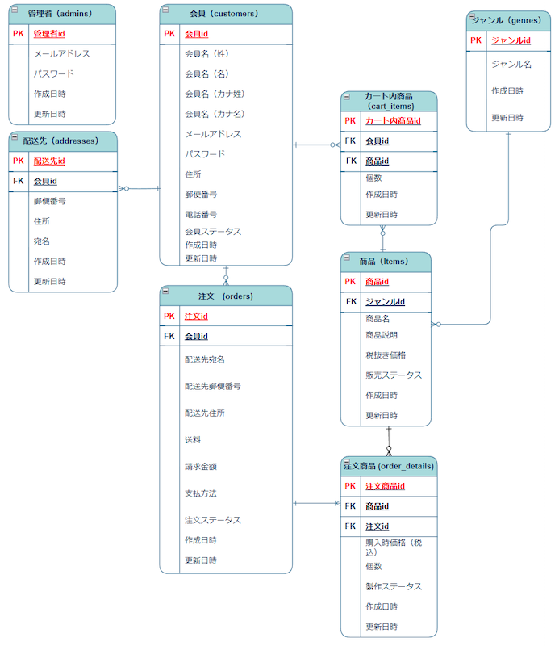

# NaganoCake

NaganoCakeは、ケーキ販売のECサイトです。このアプリでは、ケーキの商品一覧を閲覧したり、カートに追加して購入することができます。

## アプリの概要

- **目的**: 長野県の洋菓子店「ながのCAKE」の商品を全国へ通販するためのECサイト。
- **主な機能**:
  - 商品一覧の表示
  - 商品の詳細ページ
  - カート機能（複数商品購入可）
  - 会員登録・ログイン・退会機能
  - 注文履歴の閲覧
  - 配送先の登録・管理
  - 管理者による商品管理・注文管理

### ER図
以下は本アプリのデータベース設計を示すER図です：

  

### スクリーンショット
- 商品一覧ページ：
  
- カートページ：
  


## 開発環境

- **Ruby バージョン**: 3.1.2
- **Rails バージョン**: 6.1.7.10
- **データベース**: SQLite3 (開発環境)
- **その他**:
  - Bootstrap 4 を使用してデザインを整えています。

## インストール方法

1. リポジトリをクローンします。
  ```bash
  git clone https://github.com/barabara-company/naganocake
  cd naganocake
  ```
2. 必要なGEMをインストールします。
  ```bash
  bundle install
  ```
3. データベースをセットアップします。
  ```bash
  rails db:create
  rails db:migrate
  ```
4. サーバーを起動します。
  ```bash
  rails server
  ```
5. ブラウザで http://localhost:3000 にアクセスしてください。

## 使用方法

### 一般ユーザー:
- 商品を閲覧し、カートに追加して購入できます。
- 会員登録を行うことで購入機能が利用可能になります。
- 配送先を登録・管理できます。
- 注文履歴を閲覧できます。

### 管理者:
- 商品の追加・編集・削除が可能です。
- 会員情報や注文履歴の管理ができます。
- 注文ステータス・製作ステータスを管理できます。

## 今後の課題
- デザインの改善
- テストコードの追加
- 検索機能の実装（商品名検索、会員情報検索）

## ライセンス
このプロジェクトは学習目的で作成されたものであり、商用利用は想定していません。
